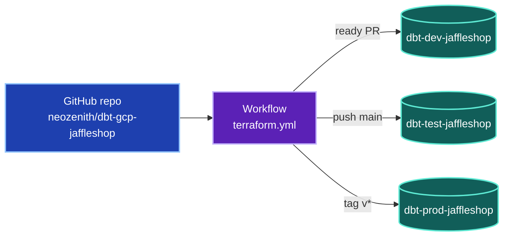
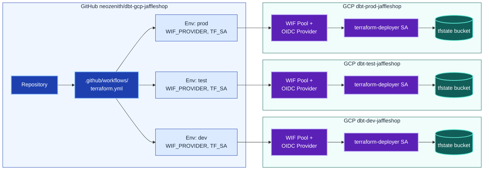
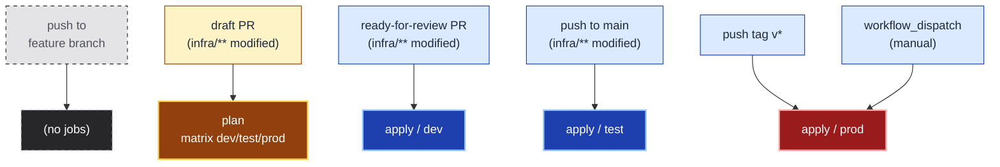
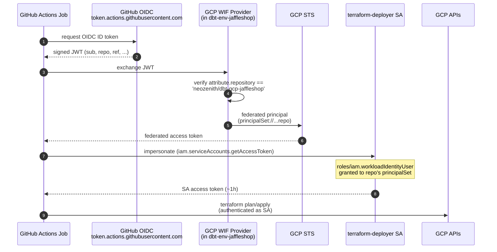

# `infra/` — Terraform Stack

A single shared Terraform stack that targets three GCP projects
(`dbt-dev-jaffleshop`, `dbt-test-jaffleshop`, `dbt-prod-jaffleshop`) via
**partial backend configuration**. The same `*.tf` files plan/apply against
any environment by switching two inputs at `init` / `plan` time:

```bash
terraform -chdir=infra init  -backend-config=./backends/<env>.config -reconfigure
terraform -chdir=infra plan  -var environment=<env>
terraform -chdir=infra apply -var environment=<env> -auto-approve
```

For first-time setup (creating the state bucket, deployer SA, and Workload
Identity Federation per project) see [`bootstrap/`](./bootstrap/README.md).

## Layout

```
infra/
├── backend.tf          # partial gcs backend block (bucket = "", prefix = "")
├── provider.tf         # google provider, project = local.project_id
├── main.tf             # locals (project_id, labels) + data.google_project smoke test
├── variables.tf        # var.environment (validated) + var.region
├── backends/
│   ├── dev.config      # bucket = "dbt-dev-jaffleshop-tfstate" + prefix
│   ├── test.config
│   └── prod.config
└── bootstrap/          # one-time GCP + GitHub setup scripts (see README)
```

## Architecture



*One GitHub repo drives three GCP projects via one workflow. Each trigger maps to exactly one environment.*

<details>
<summary>📋 Detailed diagram (15 nodes)</summary>



</details>

## CI Routing

How each Git event maps to a workflow job. **Plan everywhere** during draft
review; **apply incrementally** as the change earns trust (dev → test → prod).



*Trigger → job mapping. Red `apply / prod` is the only path that touches
production; it is gated behind tag pushes or explicit manual dispatch.* 

## Authentication (GitHub OIDC → GCP)

Every workflow job authenticates **without long-lived service-account
keys** — instead, it trades a GitHub-signed OIDC token for a short-lived
GCP access token via Workload Identity Federation. The trust relationship
is set up once by `bootstrap_project.sh` (see
[`bootstrap/`](./bootstrap/README.md) for the build-time view).

<details>
<summary>📋 Runtime token-exchange sequence</summary>



</details>

Defense-in-depth comes from gating the exchange on **both** sides:

- The OIDC provider has an `attribute-condition` that rejects any token
  whose `assertion.repository` claim does not match the expected repo.
- The SA's `roles/iam.workloadIdentityUser` binding lists only the
  `principalSet://...attribute.repository/<repo>` for the same repo.

Misconfiguring either side fails closed — the WIF token exchange returns
an error and the workflow fails before touching GCP.

## Running Terraform Locally

There's a `Makefile` in this directory that wraps every common task. From the
repo root:

```bash
make -C infra help          # list every target

make -C infra bootstrap     # one-time GCP setup (also see infra/bootstrap/README.md)
make -C infra plan-dev      # terraform plan against dbt-dev-jaffleshop
make -C infra apply-dev     # terraform apply (auto-approve)
make -C infra validate-all  # init + validate against every env's backend

make -C infra ci            # fmt-check + lint (no cloud calls)
make -C infra fmt           # terraform fmt -recursive (writes)
make -C infra docs          # regenerate the auto-doc section below
```

Or invoke `terraform` directly if you prefer:

```bash
terraform -chdir=infra init  -backend-config=./backends/dev.config -reconfigure
terraform -chdir=infra plan  -var environment=dev
terraform -chdir=infra apply -var environment=dev
```

Switching environments in the same checkout is safe — `-reconfigure` discards
the cached backend so `dev` state never gets written to `prod`'s bucket by
mistake.

## Tooling

| Tool | Role | Make target | Install |
|---|---|---|---|
| `terraform fmt` | Canonical formatter; deterministic, idempotent | `make fmt` / `make fmt-check` | bundled with terraform |
| `terraform validate` | Static syntax + reference check (per env, post-init) | `make validate-<env>` | bundled with terraform |
| [`tflint`](https://github.com/terraform-linters/tflint) | Lint rules + Google-specific ruleset (`.tflint.hcl`) | `make lint` | `brew install tflint` then `tflint --init` |
| [`terraform-docs`](https://terraform-docs.io/) | Auto-generate Inputs/Outputs/Resources tables, injected between the markers below | `make docs` | `brew install terraform-docs` |
| [`trivy config`](https://trivy.dev/latest/docs/coverage/iac/terraform/) *(optional)* | IaC security scanner — public buckets, missing encryption, overly permissive IAM | `make security` | `brew install trivy` |
| [`pre-commit-terraform`](https://github.com/antonbabenko/pre-commit-terraform) *(optional)* | Wire fmt / validate / tflint / docs into a git pre-commit hook | — | `brew install pre-commit` + `.pre-commit-config.yaml` |

The CI workflow (`.github/workflows/terraform.yml`) currently runs
`terraform init`, `terraform validate`, and `terraform plan/apply` per
environment. `make ci` is the local equivalent for the
no-cloud-credentials gates (fmt + lint).

## Reference

The block below is auto-generated by `make docs` (which runs `terraform-docs`).
Hand-edits between the `BEGIN_TF_DOCS` / `END_TF_DOCS` markers will be
overwritten — keep narrative content above this section.

<!-- BEGIN_TF_DOCS -->
## Requirements

| Name | Version |
|------|---------|
| <a name="requirement_terraform"></a> [terraform](#requirement\_terraform) | >= 1.10.0 |
| <a name="requirement_google"></a> [google](#requirement\_google) | ~> 6.0 |

## Providers

| Name | Version |
|------|---------|
| <a name="provider_google"></a> [google](#provider\_google) | 6.50.0 |

## Modules

No modules.

## Resources

| Name | Type |
|------|------|
| [google_project.this](https://registry.terraform.io/providers/hashicorp/google/latest/docs/data-sources/project) | data source |

## Inputs

| Name | Description | Type | Default | Required |
|------|-------------|------|---------|:--------:|
| <a name="input_environment"></a> [environment](#input\_environment) | Deployment environment — one of dev / test / prod. | `string` | n/a | yes |
| <a name="input_region"></a> [region](#input\_region) | Default region for regional resources. | `string` | `"australia-southeast1"` | no |

## Outputs

| Name | Description |
|------|-------------|
| <a name="output_project_id"></a> [project\_id](#output\_project\_id) | n/a |
| <a name="output_project_number"></a> [project\_number](#output\_project\_number) | n/a |
<!-- END_TF_DOCS -->
