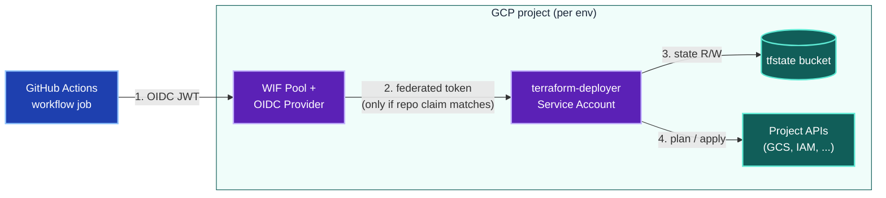
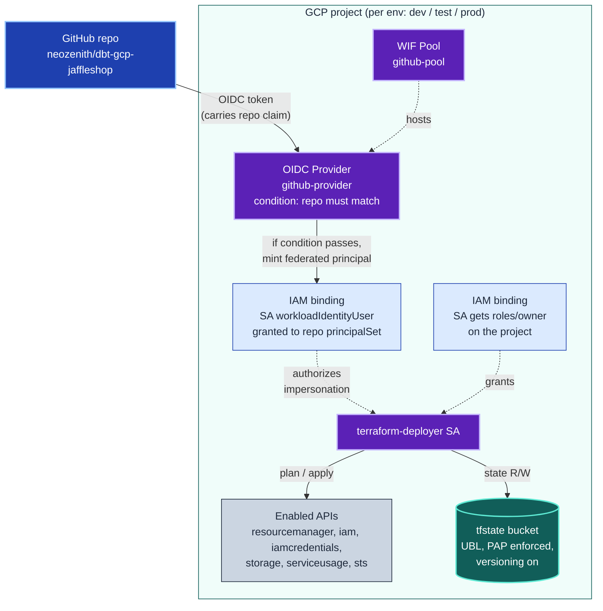

# `infra/bootstrap/`

One-time scripts that prepare each GCP project so Terraform can manage it from
GitHub Actions. Every script is idempotent — re-running is safe.

For the *decisions* that shaped this design (e.g. *why* Workload Identity
Federation instead of long-lived service-account keys), see
[`docs/arch/`](../../docs/arch/). This file documents the system *as it is*.

## Quickstart

```bash
# 1. Bootstrap GCP (all three projects)
./infra/bootstrap/bootstrap_all.sh

# 2. Bootstrap GitHub Environments + variables
./infra/bootstrap/bootstrap_github.sh
```

Or step-by-step in GCP:

```bash
./infra/bootstrap/bootstrap_project.sh dbt-dev-jaffleshop  dev
./infra/bootstrap/bootstrap_project.sh dbt-test-jaffleshop test
./infra/bootstrap/bootstrap_project.sh dbt-prod-jaffleshop prod
```

Each GCP invocation prints the two values to copy into the matching **GitHub
Environment** (Settings → Environments → `dev`/`test`/`prod`):

```
WIF_PROVIDER  = projects/<number>/locations/global/workloadIdentityPools/github-pool/providers/github-provider
TF_SA         = terraform-deployer@dbt-<env>-jaffleshop.iam.gserviceaccount.com
```

`bootstrap_github.sh` writes both vars for all three environments via the
GitHub API; the manual UI route is the fallback.

## Prerequisites

1. The three GCP projects already exist and have billing enabled:
   - `dbt-dev-jaffleshop`
   - `dbt-test-jaffleshop`
   - `dbt-prod-jaffleshop`
2. The caller is authenticated to gcloud (e.g. via `CLOUDSDK_CORE_ACCOUNT`,
   `CLOUDSDK_CORE_PROJECT`, or a prior `gcloud auth login`) with rights to:
   enable services, create service accounts, grant `roles/owner`, and create
   Workload Identity Pools + OIDC providers on each project.
3. `gh` CLI is installed and authenticated with repo-admin on the GitHub
   repo (needed by `bootstrap_github.sh`).

The scripts deliberately **do not** authenticate — they assume the caller
already has credentials, so they can't accidentally swap your active gcloud
account in a long-lived shell.

## Architecture

### Runtime trust chain

When a GitHub Actions job runs `terraform plan/apply`, this is the chain of
trust it traverses to act on GCP — all of it set up once by the bootstrap:



*Solid arrows = data/control flow. Step 2 is the security-critical gate — the
attribute-condition on the OIDC provider rejects any token whose `repository`
claim does not match this repo.*

<details>
<summary>📋 Detailed topology — every resource bootstrap creates, with their relationships</summary>



*Solid arrows = data flow (tokens / requests). Dashed arrows = IAM relationships
(hosts, grants, authorizes). Every node above is created — or in the case of
the GitHub repo, referenced — by `bootstrap_project.sh`.*

</details>

### What gets created and why

Each numbered subsection below maps to one of the resources in the detailed
diagram, in dependency order. Skipping any one of them breaks the chain — the
"Without it" line names the failure mode you'd hit.

#### 1. Enabled Google APIs

**What:** Six Google APIs activated on the project.

```
cloudresourcemanager.googleapis.com   # read project metadata, set IAM
iam.googleapis.com                    # service accounts, roles, policies
iamcredentials.googleapis.com         # required for SA impersonation
storage.googleapis.com                # GCS buckets (tfstate)
serviceusage.googleapis.com           # let TF enable further APIs later
sts.googleapis.com                    # Security Token Service — WIF exchange
```

**Why:** Each API is a hard dependency of some later step. Activating them up
front prevents the bootstrap from failing partway through with a confusing
"API has not been used or is disabled" 403. `iamcredentials` and `sts` are
the security-critical ones — without them the WIF token exchange in
[step 5–7] returns 403 at the `serviceAccounts:getAccessToken` call.

**Relates to:** Every other resource. Re-enabling an already-enabled API is
a no-op, so re-running the bootstrap is cheap.

#### 2. GCS tfstate bucket (`<project>-tfstate`)

**What:** A GCS bucket dedicated to Terraform state for this project.
Created with Uniform Bucket-Level Access (UBL), Public Access Prevention
enforced, and Object Versioning on.

**Why:**
- **Per project, not shared.** The state file *is* the source of truth.
  Cross-env state pollution (e.g. dev's apply accidentally overwriting prod's
  state) escalates from "annoying" to "incident" instantly. One bucket per
  project means a misconfigured workflow physically cannot touch the wrong
  state.
- **Versioning on.** Terraform state corruption happens (interrupted apply,
  network failure mid-write, concurrent modification). Versioning means
  recovery is `gcloud storage objects restore` away; without it, recovery
  is "re-import every resource by hand."
- **UBL + PAP.** UBL forces all access through IAM (no per-object ACL
  surprises). PAP rejects any binding that would expose the bucket publicly
  — a defense against a future `allUsers` mistake that would leak whatever
  secrets the plan output happens to contain.

**Relates to:** The deployer SA reads/writes here via its `roles/owner`
grant on the project. The bucket name is hard-wired into
`infra/backends/<env>.config` and consumed at `terraform init` time.

**Without it:** `terraform init` fails immediately (`bucket does not
exist`); apply has no place to persist state, so every run starts blind.

#### 3. `terraform-deployer` Service Account

**What:** A service account named `terraform-deployer@<project>.iam.gserviceaccount.com`.

**Why:** The identity that GitHub Actions impersonates to *do* anything in
GCP. Resource provisioning needs a stable principal that can be granted
IAM permissions; you can't grant `roles/owner` to "GitHub" — you grant it to
this SA, then arrange (via WIF + the binding in step 7) for GitHub to be
able to *act as* this SA at runtime.

**Per-project, not shared.** One deployer SA per environment means a
compromised dev workflow can't reach prod. A shared SA would re-introduce
the cross-env blast-radius problem the per-project state bucket solves.

**Relates to:** Step 4 grants it broad permissions on the project. Step 7
authorizes GitHub to impersonate it. The workflow's `google-github-actions/auth`
step is configured with this SA's email (the `TF_SA` GitHub Environment var).

**Without it:** No principal exists for IAM bindings to grant permissions
to; WIF has nothing to federate *into*.

#### 4. `roles/owner` binding on the project

**What:** The deployer SA is granted `roles/owner` on its project via
`gcloud projects add-iam-policy-binding`.

**Why:**
- The bootstrap SA needs to manage *anything* Terraform might create —
  buckets, BigQuery datasets, IAM, service accounts, secrets, networks.
  Enumerating the exact role set is a multi-day audit project per new
  resource type added.
- `roles/owner` is the *temporary* answer that lets the project ship. The
  goal is to narrow this later (see [`docs/arch/adr-0003-...`](../../docs/arch/)
  when written) once we know exactly what resource types Terraform manages.
- **The dual gate of WIF still applies.** Even with `roles/owner`, an attacker
  must first pass the OIDC provider's `attribute.repository` condition AND
  match the SA's `principalSet` binding — both of which require a token
  from this specific repo. The blast radius of `roles/owner` is bounded by
  who can run a workflow in this repo, which is bounded by repo write
  access on GitHub.

**Relates to:** Without this grant the SA can authenticate via WIF and then
do nothing, because it has no project permissions.

**Without it:** Apply fails with `Permission denied` on the first resource
Terraform tries to create or read.

#### 5. Workload Identity Pool (`github-pool`)

**What:** A GCP-native federation endpoint that can accept tokens from
external identity providers (in our case, GitHub's OIDC issuer).

**Why:** The WIF pool is the bridge between "external identity (GitHub)"
and "GCP-internal identity (Service Account)." Without it, GitHub Actions
would need to authenticate to GCP using a long-lived SA key stored as a
GitHub Secret — a substantially worse security posture (the key is a
persistent credential that can leak, rotate poorly, and lives forever in
secret stores).

**Per project, not centralized.** A common alternative is a single WIF
pool in a dedicated `iam` / `seed` project, reused by all environments.
We picked per-project for blast-radius isolation: if dev's WIF
configuration is wrong, it physically cannot grant prod-impersonation
rights, because prod's pool is a separate resource in a separate project.
The cost is more bootstrap work per environment; the gain is each project
becoming a complete, self-contained trust zone.

**Relates to:** Houses the OIDC Provider (step 6). Referenced from the
`WIF_PROVIDER` GitHub Environment variable via its full resource path
(`projects/<num>/locations/global/workloadIdentityPools/github-pool/...`).

**Without it:** GitHub Actions cannot authenticate to GCP except via a
long-lived SA key — exactly the failure mode this whole stack exists to
prevent.

#### 6. OIDC Provider (`github-provider`) — the GitHub-specific config

**What:** An OIDC provider configuration inside the WIF pool that knows how
to validate tokens from `https://token.actions.githubusercontent.com` and
how to map their claims onto GCP attributes.

**Why:** The pool is generic federation; the provider is what makes that
federation *specifically trust this repo's workflows*. It has two
configurations that together form the security boundary:

```
issuer-uri:           https://token.actions.githubusercontent.com
attribute-mapping:    google.subject = assertion.sub
                      attribute.repository = assertion.repository
                      attribute.ref = assertion.ref
                      ...
attribute-condition:  assertion.repository == 'neozenith/dbt-gcp-jaffleshop'
```

- **issuer-uri** tells GCP whose signatures to trust on incoming tokens.
- **attribute-mapping** copies fields out of the GitHub JWT into GCP-visible
  attributes that IAM bindings can match on.
- **attribute-condition** is the **first of two security gates** — any
  token that does not carry an `assertion.repository` claim matching
  `neozenith/dbt-gcp-jaffleshop` is rejected outright. A workflow in some
  other repo, even with a valid GitHub OIDC token, cannot proceed past
  this gate.

**Relates to:** The condition makes the pool useless to any other repo
even if someone misconfigured the SA binding in step 7. This is the
"defense in depth" pairing — both this condition *and* the binding in
step 7 must allow a given workflow.

**Without it:** No way to translate GitHub's OIDC issuer into GCP-issued
federated principals; WIF cannot exchange the token.

#### 7. `workloadIdentityUser` binding on the SA

**What:** An IAM binding on the `terraform-deployer` SA granting
`roles/iam.workloadIdentityUser` to:

```
principalSet://iam.googleapis.com/projects/<num>/locations/global/
  workloadIdentityPools/github-pool/attribute.repository/neozenith/dbt-gcp-jaffleshop
```

**Why:** This binding is the **second security gate**. The OIDC provider
(step 6) decides which tokens are *acceptable*; this binding decides which
acceptable tokens may *impersonate this specific SA*.

The `principalSet://` URI matches "any workflow run from this repo," via
the `attribute.repository` attribute the provider populates. So even if
someone had a valid GitHub OIDC token for a different repo (impossible if
step 6 is correct, but defense in depth), the SA's IAM policy would refuse
the impersonation.

**Relates to:** Pairs with step 6 — both must allow a given workflow.
Misconfiguring either side fails closed (token exchange returns 403).
The workflow's `google-github-actions/auth` action triggers the
impersonation against this binding via `iamcredentials.googleapis.com`'s
`generateAccessToken` endpoint.

**Without it:** Token validation passes (step 6 accepts the JWT), but no
SA permits impersonation by the resulting federated principal — apply
fails before reaching any GCP API.

#### 8. GitHub Environment + the two runtime variables

**What:** A GitHub *Environment* named `dev` / `test` / `prod` on the
repo, each with two repository-environment variables:

```
WIF_PROVIDER  = projects/<num>/locations/global/workloadIdentityPools/github-pool/providers/github-provider
TF_SA         = terraform-deployer@dbt-<env>-jaffleshop.iam.gserviceaccount.com
```

**Why these two and nothing else:** every other piece of per-env config
lives in the IaC, not in GitHub:

- **Project ID** is derived inside Terraform (`local.project_id =
  "dbt-${var.environment}-jaffleshop"`).
- **State bucket name** lives in committed `infra/backends/<env>.config`.
- The workflow passes `environment` directly per job (`-var environment=dev`).

That leaves only `WIF_PROVIDER` and `TF_SA` — values that genuinely vary
per project and *can't* be derived from convention because they embed the
GCP project number. Putting them in GitHub Environments (not repo-level
secrets) gives us per-env required reviewers and per-env branch
restrictions later, without a workflow rewrite.

**Relates to:** The workflow's `google-github-actions/auth` step reads
both vars; the resulting GCP token is used by every subsequent `terraform`
invocation in that job.

**Without it:** The workflow's auth step has no idea which provider or SA
to use; `terraform plan/apply` runs unauthenticated and fails on the first
GCP call.

## Scripts

| Script | Purpose |
|---|---|
| `config.sh` | Shared constants (repo name, region, project list). Sourced by the others. |
| `bootstrap_project.sh` | Sets up steps 1–7 above for **one** project. Usage: `bootstrap_project.sh <project-id> <env-name>`. |
| `bootstrap_all.sh` | Runs `bootstrap_project.sh` for every entry in `PROJECT_PAIRS` (dev → test → prod). |
| `bootstrap_github.sh` | Sets up step 8 — creates the GitHub Environments and writes the two vars, and adds a `v*` **tag** deployment policy to the `github-pages` environment (dbt-docs publishes the prod catalog on a tag, which the default branch-only Pages policy rejects). Run **after** `bootstrap_all.sh`. Requires `gh` authenticated with repo-admin on `${GITHUB_REPO}`. |

## Overriding defaults

The scripts honour environment variables so one-off overrides don't require
editing `config.sh`:

```bash
GITHUB_REPO=neozenith/some-fork ./infra/bootstrap/bootstrap_all.sh
TF_STATE_LOCATION=us-central1   ./infra/bootstrap/bootstrap_project.sh dbt-dev-jaffleshop dev
```

When things go wrong (billing not linked, quota exceeded, permissions
denied), see [`docs/guides/bootstrap-recovery.md`](../../docs/guides/bootstrap-recovery.md).
