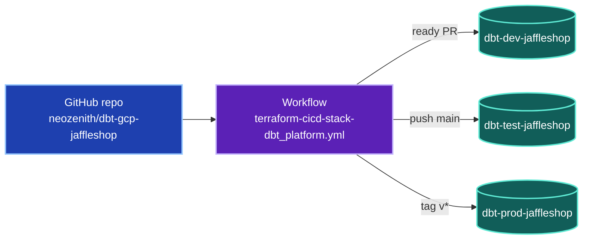
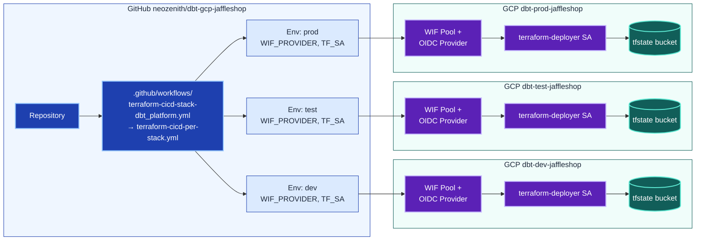
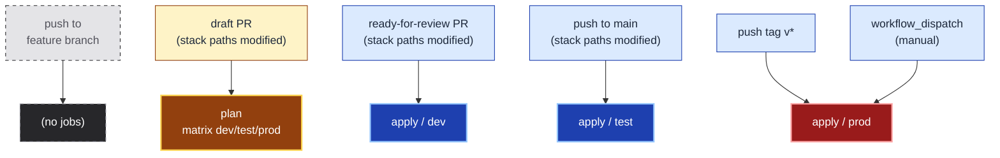

# `dbt_platform` stack

The foundational platform stack: the per-environment **dbt service accounts**,
their **BigQuery IAM** (self + cross-env reads + human developer grants), the
**Workload Identity Federation bindings** that let CI impersonate them, the
**GCS artefact buckets** for dbt's JSON outputs, and the dedicated
**`dbt-dev-elementary`** reporting SA.

It targets three GCP projects (`dbt-dev-jaffleshop`, `dbt-test-jaffleshop`,
`dbt-prod-jaffleshop`) from one set of `*.tf` files via **partial backend
configuration** — switch envs by changing two inputs at `init` / `plan` time.

> **State location:** grandfathered at `prefix = "terraform/state"` (no
> stack-name segment) — it predates the per-stack convention, so its live state
> is never moved. New stacks use `terraform/state/<stack>`; see
> [`../../README.md`](../../README.md) and
> [`docs/arch/adr-0003-stacks-and-modules-layout.md`](../../../docs/arch/adr-0003-stacks-and-modules-layout.md).

```bash
# via the wrapper (adds the gcloud project guardrail + flag wiring)
uv run --directory infra scripts/tf-stack.py plan dbt_platform dev

# or directly from infra/
terraform -chdir=stacks/dbt_platform init  -backend-config=./backends/<env>.config -reconfigure
terraform -chdir=stacks/dbt_platform plan  -var environment=<env>
terraform -chdir=stacks/dbt_platform apply -var environment=<env> -auto-approve
```

For first-time GCP setup (state bucket, deployer SA, WIF per project) see
[`../../bootstrap/`](../../bootstrap/README.md).

## Layout

```
stacks/dbt_platform/
├── backend.tf          # partial gcs backend block (bucket = "", prefix = "")
├── provider.tf         # google provider, project = local.project_id
├── main.tf             # locals (project_id) + data.google_project smoke test
├── dbt.tf              # dbt SAs, BQ IAM, WIF bindings, artefact buckets, elementary SA
├── variables.tf        # var.environment (validated) + var.region
├── dbt-developers.yml  # curated human-developer registry (decoded in dbt.tf)
└── backends/
    ├── dev.config      # bucket = "dbt-dev-jaffleshop-tfstate", prefix = "terraform/state"
    ├── test.config
    └── prod.config
```

## Architecture



*One GitHub repo drives three GCP projects via the per-stack caller workflow. Each trigger maps to exactly one environment.*

<details>
<summary>📋 Detailed diagram (15 nodes)</summary>



</details>

## CI Routing

How each Git event maps to a job in the reusable workflow. **Plan everywhere**
during draft review; **apply incrementally** as the change earns trust
(dev → test → prod). The per-stack caller fires only when this stack's paths
(`infra/stacks/dbt_platform/**`, `infra/modules/**`, or the workflows/action)
change.



*Trigger → job mapping. Red `apply / prod` is the only path that touches
production; it is gated behind tag pushes or explicit manual dispatch.*

## Authentication

Every workflow job authenticates **without long-lived service-account keys** —
it trades a GitHub-signed OIDC token for a short-lived GCP access token via
Workload Identity Federation. The full two-lens model (TF Deployer + DBT
Developer) lives in [`../../AUTH.md`](../../AUTH.md); the build-time view is in
[`../../bootstrap/README.md`](../../bootstrap/README.md).

## Running Terraform Locally

```bash
make -C infra plan-dev          # STACK defaults to dbt_platform
make -C infra apply-dev
make -C infra validate-all      # init + validate against every env's backend
make -C infra ci                # fmt-check + security + validate-backends + gha-check (no cloud)
```

Switching environments in the same checkout is safe — `-reconfigure` on init
discards the cached backend so `dev` state never gets written to `prod`'s bucket.

## Reference

The block below is auto-generated by `make docs` (terraform-docs). Hand-edits
between the markers are overwritten — keep narrative content above this section.

<!-- BEGIN_TF_DOCS -->
<!-- END_TF_DOCS -->
