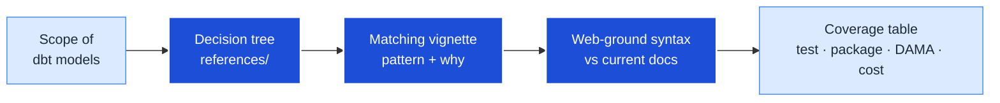
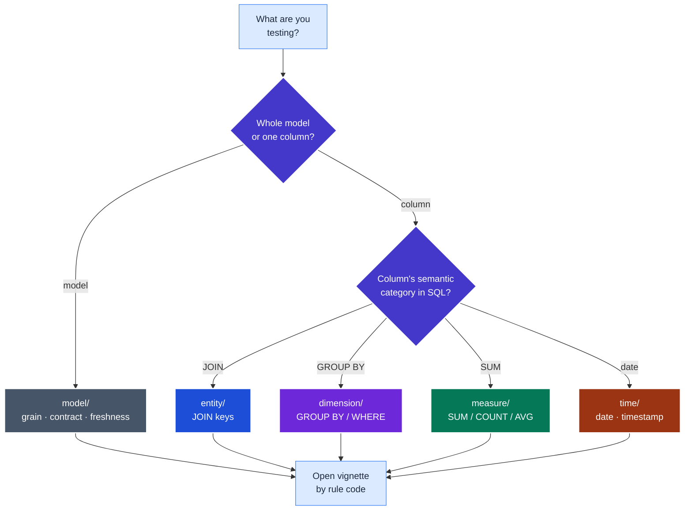

# adaf-testing-guide

Turns "what tests should these models have?" into a concrete, justified test plan. It is a
**reference-driven navigator** over a bundled testing-taxonomy catalogue: it walks a two-question
decision tree to the right *vignette* (a worked test pattern), explains why the test matters and which
package to reach for, then grounds the implementation syntax in current docs via web search. It exists
because picking the right data-quality test — and not over-testing — is a judgement call that a curated
catalogue plus a freshness check makes repeatable.

<details>
<summary>Table of contents</summary>

<!--TOC-->

- [adaf-testing-guide](#adaf-testing-guide)
  - [Quickstart](#quickstart)
  - [Architecture](#architecture)
  - [Reference](#reference)
    - [What it needs](#what-it-needs)
    - [How it operates](#how-it-operates)
    - [Worked example (the output you get)](#worked-example-the-output-you-get)
    - [Troubleshooting](#troubleshooting)
  - [For maintainers](#for-maintainers)

<!--TOC-->

</details>

## Quickstart

Three ways to reach the same guidance.

**In an agent (Claude Code / Copilot / Codex):**

```text
/adaf:adaf-testing-guide which tests should fct_orders and fct_order_items have?
```

**Directly against the catalogue** (no agent needed — the references are plain markdown):

```bash
# 1. Start at the decision tree and framework matrix:
open references/testing_taxonomy/README.md
# 2. Find the vignette for an intent by keyword:
grep -rl "unique_combination_of_columns" references/testing_taxonomy/
```

**Escape hatch — jump straight to a vignette by rule code** when you already know the test:

```bash
# codes: MD-* model · EN-* entity · DM-* dimension · MS-* measure · TM-* time
open references/testing_taxonomy/model/MD-01-grain-test.md      # the grain test
open references/testing_taxonomy/entity/EN-03-foreign-key-integrity.md
```

## Architecture

At a glance — the skill is a pipeline from a model scope to a justified, freshness-checked plan:



<details>
<summary>The two-heuristic decision tree (how a column/concern routes to a vignette)</summary>



A column can match **more than one** category (a join key that is also a `GROUP BY` axis) — take the
union of the matching suites. The catalogue's root README has the authoritative tree, framework matrix,
and DAMA-UK6 dimension map.

</details>

## Reference

### What it needs

| Requirement | Why |
|-------------|-----|
| The bundled `references/testing_taxonomy/` | The catalogue is the only source of truth for rule codes and patterns. |
| Web access (search + fetch) | Step 5 confirms package/syntax against current docs. **Degrades loudly** if unavailable — it never passes a dated example off as current. |
| A dbt project to inspect | The skill reads each model's `.sql` + `.yml` to reason about real columns and existing tests. |

It runs no warehouse queries, installs nothing, and makes no changes unless you ask it to.

### How it operates

The operating procedure (the six steps: pin grain → walk the tree → index efficiently → explain →
web-ground → summarise) lives in [`SKILL.md`](SKILL.md). This README does not restate it — `SKILL.md`
is the agent's operating manual; read it for the exhaustive flow.

### Worked example (the output you get)

For `fct_order_items`, the skill returns a prioritised plan, grain-first:

| Model | Concern | Test (rule) | Package | DAMA | Cost | Status |
|---|---|---|---|---|---|---|
| `fct_order_items` | grain `(order_id, line_number)` | `unique_combination_of_columns` (MD-01) | dbt-utils | Uniqueness | scan-bound | add |
| `fct_order_items` | `order_id` → orders dim | `relationships` (EN-03) | dbt core | Consistency | cheap | add |
| `fct_order_items` | `quantity` | `accepted_range` ≥ 0 (MS-01) | dbt-utils | Validity | cheap | present |

### Troubleshooting

| Symptom | Cause | Fix |
|---------|-------|-----|
| Skill recommends a test the model shouldn't have | A vignette's *When NOT to use* was skipped | Quote the negative-space bullets; some models are deliberate fixtures — a missing test is not always a defect. |
| Suggested package/syntax looks stale | Web grounding (step 5) didn't run | Check whether web tools were available; if not, treat the package choice as **unverified** and confirm against `docs.getdbt.com` before merging. |
| A rule code is cited that doesn't exist | Fabricated code | Only codes present in `references/testing_taxonomy/` are valid — there is no external rule catalogue. |
| Skill not found by Copilot/Codex | Tool scans `.agents/skills/`, not plugin dirs | The repo exposes the skill via an `.agents/skills/` symlink; see the [plugin README](../../README.md). |

## For maintainers

Design rationale, the ADR log, and the extension checklist live in [`CLAUDE.md`](CLAUDE.md). Read it
before changing the skill — it records *why* this is reference-driven and freshness-gated rather than a
CLI driver.
